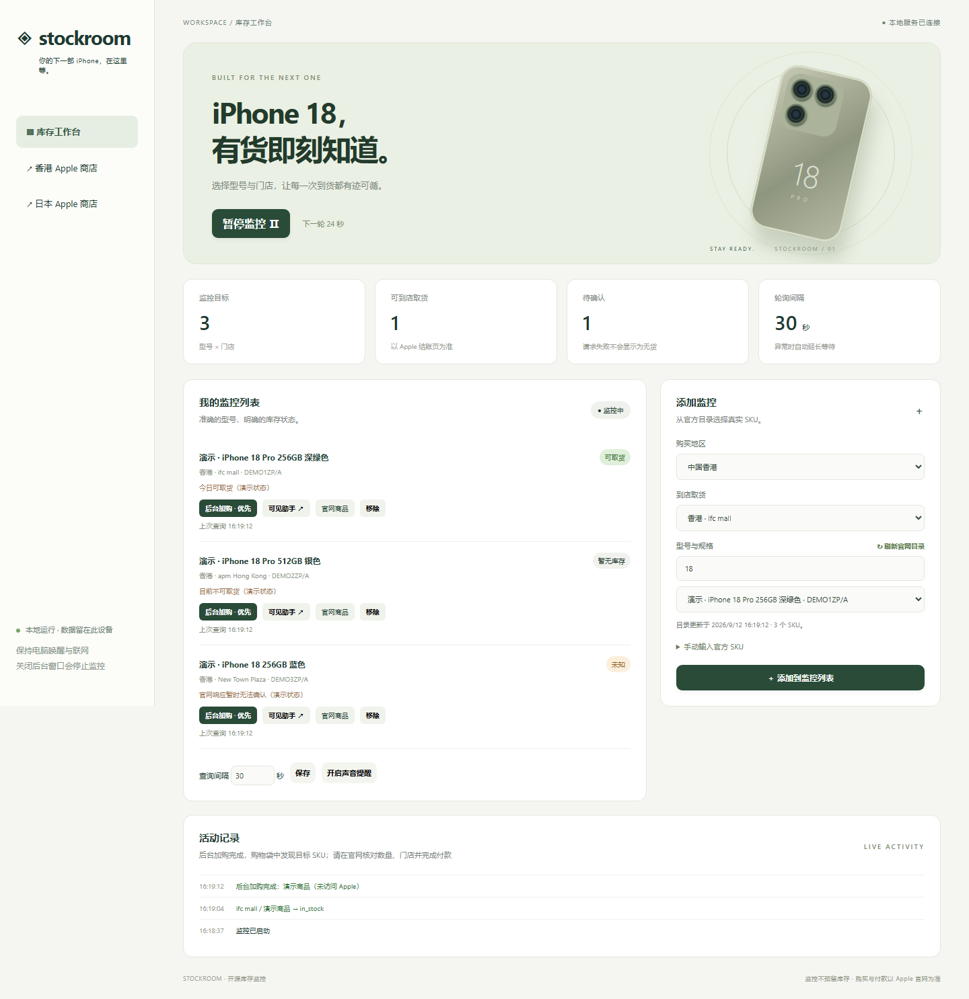
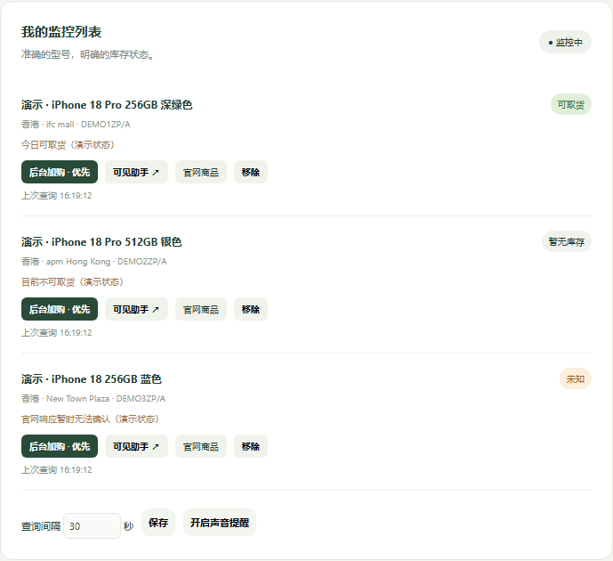
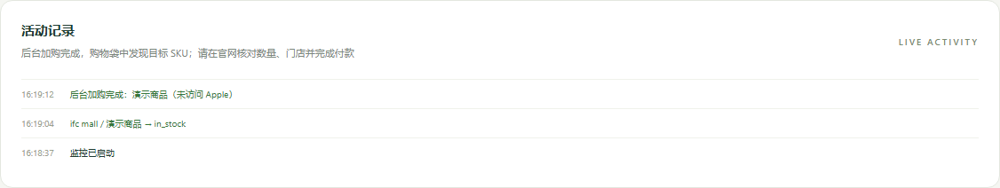

# iPhone 18 Stockroom 详细使用说明

本工具在本机运行，用于查询 Apple 官方门店取货库存，并提供两种加购辅助方式。库存查询通过后台 HTTP 请求完成，不控制电脑鼠标；购买助手通过独立的 Edge、Chrome 或 Playwright Chromium 会话操作网页元素。

> 文档截图使用本地演示数据生成，没有访问 Apple，也不表示截图中的型号已经发布或有货。

## 1. 启动程序

### Windows 便携版

1. 解压完整的 `iPhone18Stockroom-windows-x64.zip`，不要只复制其中的 EXE。
2. 双击 `iPhone18Stockroom.exe`，或运行 `Start-Windows.cmd`。
3. 保持启动窗口开启。关闭该窗口会停止后台监控。
4. 默认浏览器会打开本地工作台。如果没有自动打开，请复制启动窗口显示的完整本地地址到浏览器。

### macOS 便携版

1. 根据处理器选择 Apple 芯片版或 Intel 版 ZIP，并完整解压。
2. 双击 `Start-Mac.command`。
3. 首次启动若被 macOS 阻止，请在系统安全设置中允许本次启动。
4. 保持终端窗口开启，关闭终端会停止监控。

### 从源码启动

```powershell
python -m pip install -r monitor/requirements.txt
python monitor/app.py
```

如果不希望启动时自动打开工作台页面，可以运行：

```powershell
python monitor/app.py --no-browser
```

程序会输出一个包含随机会话凭证的本地地址。需要操作时，在同一台电脑的浏览器中打开该地址。不要把完整地址发送给其他人。

## 2. 认识工作台



页面主要分为四部分：

1. 顶部显示监控是否运行、目标总数、可取货数量、未知数量和轮询间隔。
2. “我的监控列表”显示每个型号与门店的最新状态，并提供两种购买入口。
3. “添加监控”用于选择地区、门店、型号和 SKU。
4. “活动记录”显示库存变化、网络错误和购买助手结果。

关闭这个网页不会停止库存查询，但声音提醒依赖网页保持打开。关闭程序启动窗口才会停止后台服务。

## 3. 添加监控目标

1. 在“购买地区”选择香港、日本或其他已支持地区。
2. 在“到店取货”选择一家 Apple Store。
3. 点击“刷新官网目录”，等待官方商品目录载入。
4. 在筛选框输入型号、容量或颜色，例如 `18 Pro`、`512GB`。
5. 从“型号与规格”列表选择商品。
6. 点击“添加到监控列表”。

切换地区后，应重新刷新该地区的目录。不同地区的 SKU 不能混用。

如果目录暂时无法载入，也可以展开“手动输入官方 SKU”，填入从对应地区 Apple 官网确认的零件号。手动输入只添加监控目标，不证明该型号已发布或存在库存。

## 4. 开始库存监控

1. 至少添加一个目标。
2. 根据需要设置查询间隔，允许范围为 30–3600 秒。
3. 点击“开始监控”。
4. 可点击“开启声音提醒”。浏览器通常要求你先与页面交互，才能播放声音。
5. 不需要查询时点击“暂停监控”。

状态含义：

| 状态 | 含义 | 建议操作 |
|---|---|---|
| 可取货 | 官方响应表示目标门店可取货 | 打开购买助手，并在结账页再次核对 |
| 暂无库存 | 官方响应明确为不可取货 | 继续监控 |
| 不支持取货 | 当前商品或门店不支持该方式 | 更换型号或门店 |
| 未知 | 网络失败、限流或官方响应字段不完整 | 等待下轮，不要把它当成无货 |
| 待查询 | 目标刚添加或监控尚未启动 | 启动监控 |

发生网络错误时，程序会自动延长下一轮等待时间，成功后恢复设定的间隔。

## 5. 选择购买方式



每个目标有两个购买入口，后台加购是默认和优先方式。同一时间只运行一个购买任务，避免多个浏览器会话争用同一个资料目录。Docker 内置无头 Chromium，只启用后台加购；可见助手会显示为“原生版”且不可点击。

| 方式 | 浏览器窗口 | 适用情况 | 需要人工处理的内容 |
|---|---|---|---|
| 后台加购 | 不显示 | SKU 页面可直接加购，且登录状态有效 | 本地确认；之后核对购物袋、门店和付款 |
| 可见助手 | 显示 | 首次使用、需要登录、验证码、选择服务或页面结构变化 | 在商品页核对选项并点击悬浮确认按钮 |

### 后台加购

1. 在目标卡片点击“后台加购”。
2. 本地工作台会显示确认框，其中包含商品名称和 SKU。
3. 核对无误后确认。独立无头浏览器会在后台打开目标页面。
4. 程序再次检查页面是否包含目标 SKU，并确认页面上只有一个可用的加购按钮。
5. 程序只点击一次加购按钮，然后打开购物袋进行核对。
6. 后台会话完成后自动关闭，结果显示在“活动记录”上方。

后台模式不会自动登录、绕过验证码、选择付费服务、选择取货门店或提交付款。原生版遇到这些页面时使用“可见助手”；Docker 版请打开官网商品，或改用原生版。Docker 的浏览器资料位于命名卷中，不与宿主机浏览器共享登录或购物袋。

### 可见助手

1. 在目标卡片点击“可见助手 ↗”。
2. 程序打开一个独立 Edge 或 Chrome 窗口。
3. 在商品页检查型号、容量、颜色、服务选项和登录状态。
4. 确认无误后点击页面右下方的“我已确认选项 · 加入购物袋”。
5. 程序核对 SKU，并只尝试点击一次加购按钮。
6. 在购物袋中核对数量，选择取货门店，并自行完成登录和付款。
7. 完成或放弃操作后关闭购买窗口，新的购买任务才可以启动。

## 6. 查看后台任务结果



常见结果包括：

- “购物袋中发现目标 SKU”：程序找到了目标商品，但仍需你核对数量、门店和付款信息。
- “无法确认购物袋 SKU”：程序执行过一次加购，但无法证明成功。改用可见助手检查。
- “加购按钮不可用”：页面可能要求先选择选项、登录或处理验证码。
- “页面未确认目标 SKU”：页面内容或网址与目标不一致，程序会停止，不会替换成其他型号。
- “已有购买任务”：等待后台任务完成，或关闭当前可见购买窗口后再试。

## 7. 多任务与浏览器冲突

库存查询不会操作浏览器窗口或系统鼠标，可以继续在电脑上正常工作。

购买助手通过网页元素定位完成点击，不依赖屏幕坐标。单个程序实例内部会串行处理购买任务。若同时启动多个程序实例，应给每个实例指定不同的数据目录：

```powershell
python monitor/app.py --data-dir C:\Stockroom\account-a
python monitor/app.py --data-dir C:\Stockroom\account-b
```

不同实例不要共用同一个 `--data-dir`，否则浏览器资料目录可能被占用。即使浏览器会话相互隔离，多个任务操作同一 Apple 账号或同一购物袋时仍可能产生业务层面的冲突。

## 8. 数据保存位置

- Windows：默认保存在 `%LOCALAPPDATA%\iPhone18Stockroom`。
- macOS：默认保存在 `~/Library/Application Support/iPhone18Stockroom`。
- 自定义位置：使用 `--data-dir 路径`。

其中包含监控配置、目录缓存和购买助手浏览器资料。升级程序时保留该目录即可保留配置和登录资料。

## 9. 常见问题

### 点击后台加购后提示登录或验证码

使用可见助手完成登录或验证码。可见模式和后台模式使用同一个购买助手资料目录，关闭可见窗口后，后续后台任务可以复用已保存的会话；Apple 仍可能要求重新验证。

### 后台模式无法找到加购按钮

这通常表示商品需要选择额外选项、页面结构发生变化，或者当前不可购买。使用可见助手查看实际页面，不要连续重复点击后台加购。

### 没有 Edge 或 Chrome

源码版本可以安装 Playwright Chromium：

```powershell
python -m playwright install chromium
```

### 页面关掉后还在监控吗

会。网页只是本地控制界面。只要程序启动窗口仍在、电脑联网且没有休眠，后台查询就会继续。

### 如何完全停止

关闭启动程序的命令行窗口，或在该窗口按 `Ctrl+C`。

## 10. 开发者验证

```powershell
python -m unittest discover -s monitor -p test_monitor.py -v
python monitor/smoke_headless.py
python monitor/capture_docs.py
```

`smoke_headless.py` 只在本地测试页面上启动无头浏览器并点击测试元素，不访问 Apple。`capture_docs.py` 使用演示数据重新生成本文截图。
